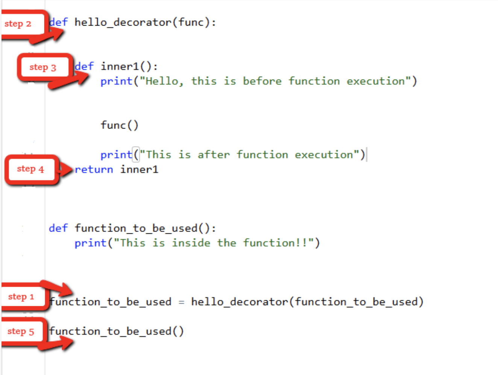
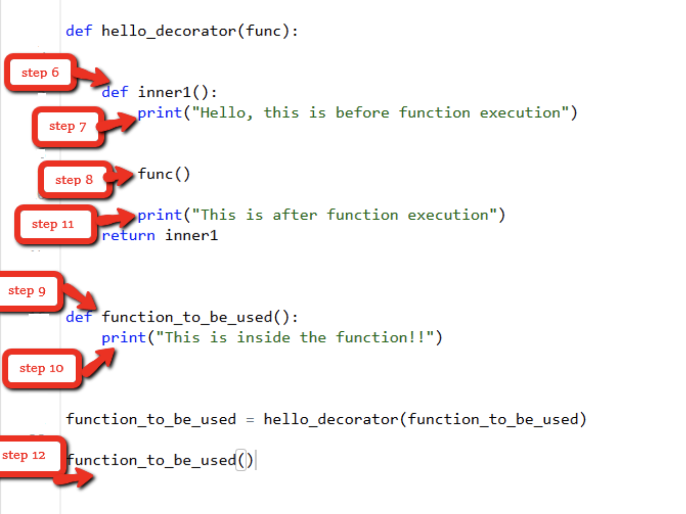

## 前言

​	因为之前一直用的C，所以对于新接触的python一些特性不太适应，比如说python的装饰器(decorator)，就在这里写点笔记，记录下学习理解python装饰器。


​	那什么是python装饰器，这里引用一段之前在别人blog上看到的一段修饰：

> 每个人都有的内裤主要功能是用来遮羞，但是到了冬天它没法为我们防风御寒，咋办？我们想到的一个办法就是把内裤改造一下，让它变得更厚更长，这样一来，它不仅有遮羞功能，还能提供保暖，不过有个问题，这个内裤被我们改造成了长裤后，虽然还有遮羞功能，但本质上它不再是一条真正的内裤了。于是聪明的人们发明长裤，在不影响内裤的前提下，直接把长裤套在了内裤外面，这样内裤还是内裤，有了长裤后宝宝再也不冷了。装饰器就像我们这里说的长裤，在不影响内裤作用的前提下，给我们的身子提供了保暖的功效。

​	所以简单来说，python装饰器就是在原有的功能上，外面再裹一层功能，但是不改变原有的部分。

> 在python中，一切皆对象。

​	这句话是前提，因为习惯用C或者一些非面向对象语言的时候，接触python可能有点不太适应，在函数变量的时候，python可以将函数作为一个变量进行传递。这个是装饰器实现的前提。装饰器本质上是一个Python的函数或者类，它可以让其他函数或类在不需要做任何代码的修改前提下，新添加额外的功能，它的返回值也是一个函数或者类对象。


## 背景

​	当我们要将函数作为参数进行传递的时候，通常的做法如下：

```python
def foo(cls):
    perform method operation
foo = classmethod(foo)
foo = synchronized(lock)(foo)
```

> This becomes less readable with longer methods. It also seems less than pythonic to name the function three times for what is conceptually a single declaration.

​	根据python官方文档原话，这样的做法，会降低代码的可读性，并且当一个函数被传递给多个功能时，需要多次重复声明，这显然很不pythonic。

​	因此， 装饰器诞生了。有了装饰器以后，我们可以写出更加简洁优雅的代码。

```python
@classmethod
@synchronized(lock)
def foo(cls):
    pass
```

​	那下面就一步一步就剥开装饰器decorator这层外壳。


## 装饰器decorator

​	既然写代码，那肯定得根据业务需求来。先举个🌰，比如说，我们原来已经写好了一段代码：

```python
def foo():
    print('A foo')
```

​	现在新需求来了，需要我们在原来的代码基础上，添加一个记录函数运行时间的功能。

```python
def foo():
    print('A foo')
    logging.info('>>>>foo is running')
```

​	OK，新需求暂时性解决了。但是，如果我们还有foo1，foo2需求添加日志功能呢。是在每个foo里面都新写一段log功能吗？这样显然是最笨的方法。那么我们可以定义一个专门用来写log的功能函数，每次都调用这个函数，听起来是个不错的解决方式。

```python
def logging_func(func):
    logging.info('>>>>{} is running'.format(func.__name__))
    func()

def func():
  pass


logging_func(func)
```

​	这样子，我们的功能需求就满足了。但是，这样子处理以后，每次的调用变成了调用logging_func函数，而真正的业务代码func却变成了参数进行传递。这个时候，装饰器就派上用场了。


##### 简单的装饰器实现

```python
def logging_func(func): 
    def wrapper():
        logging.info('>>>>{} is running'.format(func.__name__))
        return func()  # execute foo function, foo()
    return wrapper

def foo():
    pass

  
foo = logging_func(foo)
foo()  # execute wrapper function, wrapper()
```


##### 语法糖

​	在python中，@符号表示语法糖，只要将它写在函数开始定义的地方，就可以省略最后一步再次赋值的操作。

```python
def logging_func(func): 
    def wrapper():
        logging.info('>>>>{} is running'.format(func.__name__))
        return func()  # execute foo function, foo()
    return wrapper

@logging_func
def foo():
    pass
  
  
foo()
```

​	如上所示，有了@， 我们就可以省略掉重新复制的操作。如果有新的功能需求需要添加，我们只需要定义好功能以后，使用语法糖就可以修饰我们的业务代码，而不用重复修改函数或者增加新的封装了。这样就提高了代码的可读性和可复用性。


##### 参数传递

​	假如说，我们的业务代码需要传递参数，那么这种情况下应该怎么使用装饰器。例子如下：

```python
def calculate_time(func):
    def inner(*args, **kwargs):
        begin = time.time()
        func(*args, **kwargs)
        end = time.time()
        print('Total time taken by {}: {}'.format(func.__name__, end - begin))
    return inner


@calculate_time
def factorial(num):
    time.sleep(2)
    print(math.factorial(num))


factorial(10)
```

​	这里我们用到了*args和**kwargs，在不清楚参数个数的情况下，使用 *args，来传递一个list类型的可变参数，使用 *kwargs来传递一个字典类型的关键字参数。


##### 类装饰器

​	装饰器不仅仅可以修饰函数，还可以用来修饰类。使用类装饰器主要依赖类的 \__call__ 方法。当我们使用@方式将装饰器附加到函数上的时候，就会调用该方法。

```python
class Foo(object):
    def __init__(self, func):
        self._func = func
    
    def __call__(self):
        print('enter class decorator')
        self._func()
        print('exit class decorator')
    

@Foo
def foo():
    pass

 
foo()
```


##### functools.wraps

​	使用装饰器很方便，但是会遇到一个坑，那就是原函数的元信息会丢失，比如说函数的__docstring，\__name__，参数列表等等。看看这个例子：

```python
def logging_func(func):
    def func_info(*args, **kwargs):
        print(func.__name__)  # output: func_info
        print(func.__doc__)  # output: None
        return func(*args, **kwargs)
    return func_info

@logging_func
def foo(x):
    """do something"""
    pass
```

​	那么这种情况下，我们就需要用到__functools.wraps__来解决这个问题了。__wraps__本身也是一个装饰器，它能够把原函数的元信息拷贝到装饰器里面的func函数里面，这样子，装饰器里的元信息就和原函数的一样了。

```python
from functools import wraps

def logging_func(func):
    @wraps(func)
    def func_info(*args, **kwargs):
        print(func.__name__)  # output: foo
        print(func.__doc__)  # output: do something
        return func(*args, **kwargs)
    return func_info

@logging_func
def foo(x):
    """do something"""
    pass
```


##### 执行顺序

​	最后一个问题，就是装饰器的执行顺序问题。借用网上两张图：






## 总结

​	python还有很多奇技淫巧等着去发掘，这里就先写着装饰器。总言之，一切奇技淫巧的出现，都是为了我们更好地提高生产力。平时在写代码的时候，多思考，遇到一些重复出现的代码或者是问题时，我们可以想办法怎么用更简洁更快的方式去解决，而不要停留在单纯地写if-else，生命在于coding。